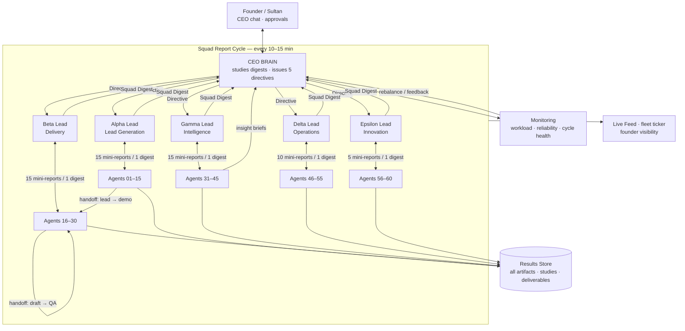

# Communicating with 60 AI Agents
## A Management System for the Qimmah Digital Fleet

**Prepared for:** Sultan, Founder — Qimmah Digital (قمة ديجيتال), Oman
**Task ref:** `create_task / "Communicating with 60 AI Agents" / High / Agent-01`
**Date:** August 2026

---

## 1. Executive Summary

Qimmah Digital runs on one founder and a fleet of 60 AI agents. The bottleneck in such a company is never the agents' speed — it is the founder's attention. If all 60 agents report directly to one human, the human becomes the queue. This report proposes (and documents, as partially implemented in the Qimmah Command Center) a **three-tier hierarchical operating system**:

- **60 Workers** execute tasks and file structured reports.
- **5 Squad Alphas** aggregate worker output into squad digests and translate CEO directives into squad-level work.
- **1 CEO Brain** studies the five digests, produces one consolidated Full Study, and issues one directive per squad.

The full loop — report up, study, directive down — completes in **10–15 minutes**, unattended. Around this loop sit four supporting systems: a standardized agent interface, an automated work-assignment engine, a defined communication protocol, and a monitoring layer with feedback. Together they meet the four goals: less manual intervention, better task-agent fit, seamless collaboration, and no overloaded agents.

---

## 2. Agent Categorization Approach

### 2.1 Principle: categorize by *mission*, not by tool

Agents are grouped by the business outcome they own. This keeps each squad's success measurable in one sentence.

| Squad | Size | Mission | Example roles |
|---|---|---|---|
| **Alpha** | 15 | Lead Generation | Cold Outreach, Instagram Lead Gen, Email Campaigns, Facebook Ads, Google Ads, WhatsApp Bot, Landing Pages, SEO Keywords, Content Strategy, Social Scheduler, Influencer Outreach, CRM Manager, Pricing Analyst, Referral Engine |
| **Beta** | 15 | Delivery | Web Developer, 3D Modeling Specialist, Copywriter, Designer, Video Editor, QA, Client Reporting |
| **Gamma** | 15 | Intelligence | Market Research, Competitor Tracking, Trend Scanning, Data Analysis |
| **Delta** | 10 | Operations | Scheduling, Invoicing, Contracts, File Management, Support |
| **Epsilon** | 5 | Innovation | New Service R&D, Process Experiments, Tool Evaluation |

### 2.2 Capability profiles

Every agent carries a machine-readable profile — this is the foundation for automatic assignment:

```
AgentProfile {
  code:        "Agent-23"
  squad:       "Alpha"
  role:        "SEO Keywords"
  strengths:   ["keyword research", "arabic SEO", "on-page audits"]
  capacity:    3            // concurrent tasks
  costPerTask: "1 AI call"  // resource footprint
  reliability: 0.0–1.0      // updated by monitoring (§7)
}
```

### 2.3 Dynamic re-categorization

Squads are not permanent. The monitoring layer (§7) tracks per-agent and per-squad throughput; if one squad is a chronic bottleneck and another is idle, the CEO Brain recommends rebalancing (e.g., temporarily moving a Gamma analyst into Beta during a delivery crunch). In the Command Center this is the existing **agent on/off toggle** plus squad counts on the AI Agents board — the recommendation becomes a one-click action for the founder.

---

## 3. Standardized Agent Interface

Every agent — regardless of role — exposes the same four verbs. This is what makes 60 agents manageable as one system.

### 3.1 The four-verb contract

| Verb | Direction | Payload | Purpose |
|---|---|---|---|
| `receive(task)` | Alpha → Agent | Task envelope (§5.2) | Accept work |
| `report()` | Agent → Alpha | Mini-report | File status/results |
| `ask(question)` | Agent → Alpha → CEO | Blocker/clarification | Escalate when stuck |
| `handoff(artifact, toAgent)` | Agent → Agent | Deliverable + context | Pass work across squads |

### 3.2 The mini-report format (standardized output)

```
MiniReport {
  agent, squad, taskId
  status:        done | in-progress | blocked
  work:          one-line description of what was produced
  artifactRef:   link/id of file in Results store
  blocker:       null | description
  next:          proposed next action
}
```

Because every agent speaks this format, the Alpha can aggregate 15 reports mechanically — no human parsing required. In the Command Center this is implemented as the deterministic mini-report generator in the Squad Report Cycle, with artifacts persisted to the Results store (`S.results[]`).

### 3.3 The directive format (standardized input)

```
Directive {
  from: "CEO Brain", to: "Squad Alpha"
  cycleId, issuedAt
  objective:   one sentence
  priorities:  ordered list
  constraints: budget/time/quality bars
  deadline:    next cycle
}
```

---

## 4. Communication Protocol

### 4.1 The Squad Report Cycle (10–15 minutes)

The protocol is a repeating four-phase loop. It is already live in the Command Center:

1. **REPORT (Agents → Alphas).** All 60 agents file mini-reports on their current tasks. Cost: zero AI calls — reports are assembled deterministically from task state and recent results.
2. **COMPILE (Alphas).** Each squad's lead agent aggregates its 15/10/5 reports into a **Squad Digest**: wins, blockers, metrics, asks. One AI call per squad (template fallback when offline).
3. **STUDY (CEO Brain).** The five digests go to the CEO Brain, which produces one **Full Study**: key findings, cross-squad insights, and exactly one directive per squad. One AI call.
4. **DIRECT (CEO Brain → Alphas → Agents).** Each directive lands in the squad's `squadDirectives` slot, is displayed as the squad's "Latest directive from CEO Brain" card, and shapes the next cycle's agent reports.

### 4.2 Channels

| Channel | Carries | Where it lives |
|---|---|---|
| **Reports channel** | Mini-reports, digests | Cycle engine |
| **Command channel** | Directives, task assignments | Squad directive cards, Tasks board |
| **Feed channel** | Timestamped activity lines for the human | Live Feed / fleet ticker ("Agent-23 filed report", "CEO Brain issued directive to Squad Alpha") |
| **Escalation channel** | Blockers, questions, risks | Surfaced to CEO chat as fleet messages |

### 4.3 Rules that keep the protocol clean

1. **No worker-to-CEO traffic.** Workers never message the CEO Brain directly; everything flows through the Alpha. This caps CEO-side messages at ~5 per cycle instead of 60.
2. **One directive per squad per cycle.** A squad never juggles conflicting orders.
3. **Everything is logged.** Reports, digests, studies, and directives are all persisted, so any decision can be traced back to the evidence that caused it.
4. **Human override always open.** The founder can type directly into the CEO chat at any time; manual instructions outrank cycle directives.

---

## 5. Work Assignment System

### 5.1 Flow

```
Founder request (CEO chat)
   └─► CEO Brain decomposes request into tasks
        └─► Task Router scores every agent:
              fit      = strengths match vs. task tags
              load     = current tasks / capacity
              track    = reliability score (from monitoring)
            └─► Task assigned to best (fit × track) with load < capacity
                 └─► Squad Alpha confirms / re-routes within squad
                      └─► Agent executes, files mini-report, delivers artifact
```

### 5.2 Task envelope

```
Task {
  id, title, priority: high|medium|low
  tags:        ["website", "arabic-copy"]
  deliverable: expected artifact spec (filename, format)
  requester:   founder | CEO-Brain | squad-directive
  status:      backlog → in-progress → review → done
}
```

This maps directly onto the Command Center's existing **Tasks Board** (Backlog / In Progress / Review / Done with agent assignment) — the automation layer simply fills the "Assign Agent" dropdown instead of the founder doing it.

### 5.3 Two assignment modes

- **Push mode (default):** the router assigns instantly; founder sees assignments on the board and in the feed.
- **Approve mode (high-stakes):** for client-facing deliverables above a value threshold (e.g., anything touching a paying client like Al Zawiya Turkish Restaurant), the router proposes and the founder taps approve. Configurable per task type.

### 5.4 Deliverable completion

Assignment is not finished when the agent "replies" — it is finished when a **file exists**. Every work task must end with a downloadable artifact (`.md` / `.html`) stored in Results and announced in the CEO chat as a "Work delivered" card. This rule — *no artifact, no done* — is the single biggest quality lever in the system.

---

## 6. Diagram — Communication Protocol & Work Assignment

### 6.1 Flowchart



### 6.2 Text version (for the Command Center Results feed)

```
FOUNDER
  │  request / approval
  ▼
CEO BRAIN ──directive──► 5 SQUAD ALPHAS ──task──► 60 AGENTS
   ▲                          │                      │
   │ 5 digests                │ 15/10/5 mini-reports │
   └──────────────────────────┴──────────────────────┘
                              │
                              ▼
                    RESULTS STORE → MONITORING → rebalance
                    LIVE FEED (founder watches everything)
```

---

## 7. Monitoring & Feedback System

### 7.1 What is tracked

| Metric | Per | Source | Threshold → action |
|---|---|---|---|
| **Workload** | agent | active tasks ÷ capacity | >100% → router stops assigning; Alpha redistributes |
| **Cycle health** | system | cycle duration, phases completed | >15 min → trim digest length; failed phase → retry once, then log |
| **Throughput** | squad | artifacts delivered per day | falling 2 cycles → CEO Brain investigates in next Full Study |
| **Reliability** | agent | deliverables accepted ÷ assigned (review column) | <0.7 → agent gets easier tags / paired QA |
| **Directive execution** | squad | did next-cycle reports reference the directive? | no → Alpha flagged in feed |
| **Blocker age** | task | time in "blocked" | >2 cycles → auto-escalate to CEO chat |

### 7.2 Feedback loops

- **Tactical (every cycle):** directives are informed by the last cycle's reports — the system corrects itself every 10–15 minutes.
- **Method (every ~6 study cycles):** a meta-learning pass reviews *how* the fleet worked and writes a Method Improvement card that is injected into future prompts — the fleet studies how to study.
- **Strategic (weekly):** the CEO Brain compiles a standup report — throughput by squad, revenue pipeline impact, top blockers, and a recommended rebalance — delivered to the founder as a downloadable file.

### 7.3 Founder dashboard (visibility without micromanagement)

The founder never reads 60 reports. He sees: the Live Feed ticker, one Full Study per cycle in Results, per-squad directive cards, the Tasks board, and the weekly standup. Five minutes of reading per day for full situational awareness.

---

## 8. Recommendations for Implementation

Ordered by impact ÷ effort:

1. **Turn on task auto-routing (Goal 1).** Implement the scoring router of §5.1 on top of the existing Tasks board: when a task is added, auto-fill the best agent using the AgentProfile strengths/load/track scores. Keep the dropdown editable.
2. **Enforce "no artifact, no done" everywhere.** Every completed task must attach a downloadable file in Results. This is already true for CEO-chat deliverables — extend it to the Tasks board review column.
3. **Add reliability scoring (Goal 2).** Count accepted vs. returned deliverables per agent; feed the score into the router. Start simple: +1 accepted, −1 returned, normalized 0–1.
4. **Add the overload guard (Goal 4).** Hard rule in the router: never assign beyond capacity; surface a "Squad overloaded" warning card when any squad exceeds 85% aggregate load for two consecutive cycles.
5. **Wire handoffs (Goal 3).** Formalize the two most common cross-squad paths — Alpha (qualified lead) → Beta (demo/proposal), and Beta (draft) → Beta-QA — as one-click handoff buttons on task cards so context never gets lost in chat.
6. **Keep AI calls at the top of the pyramid.** Agents report deterministically (free); only the 5 Alpha digests and 1 Brain study use AI calls per cycle. At 12-minute cycles that is ~720 calls/day — well within free-tier Groq limits. Do not give all 60 agents live AI calls per cycle; it multiplies cost without adding signal.
7. **Persist everything, back up daily.** All protocol artifacts already live in the single state object covered by the one-file Backup export. Make a daily backup a habit (the amber "Protect your data" banner warns after 7 days).
8. **Review the weekly standup every Sunday.** Ten minutes: approve/reject the proposed rebalance, set the week's one priority per squad. This is the founder's entire management burden in the steady state.

---

## 9. Conclusion

The design turns 60 agents from a crowd into a company: workers file standardized reports, five Alphas aggregate and translate, one CEO Brain studies and directs, and a monitoring layer keeps workloads balanced and quality rising — all inside a 10–15 minute self-correcting loop that the founder supervises, not operates. Much of this loop is already running in the Qimmah Command Center (Squad Report Cycle, directive cards, Live Feed, deliverable enforcement in chat); the recommendations above close the remaining gaps — auto-routing, reliability scoring, overload guards, and formal handoffs — in order of cheapest-first.
