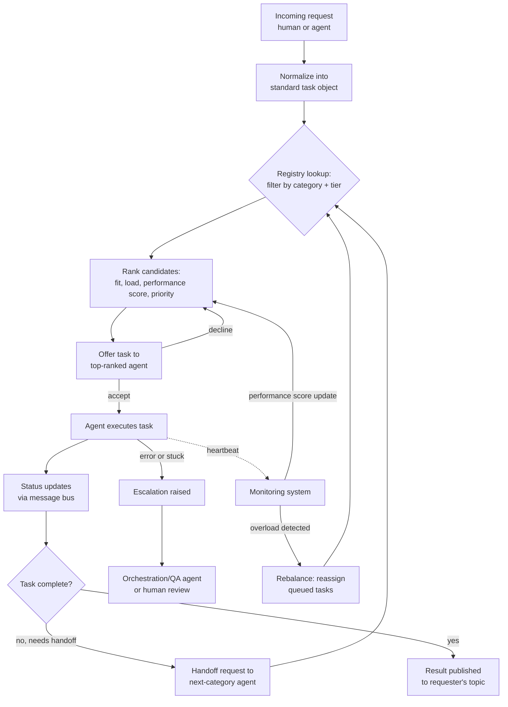
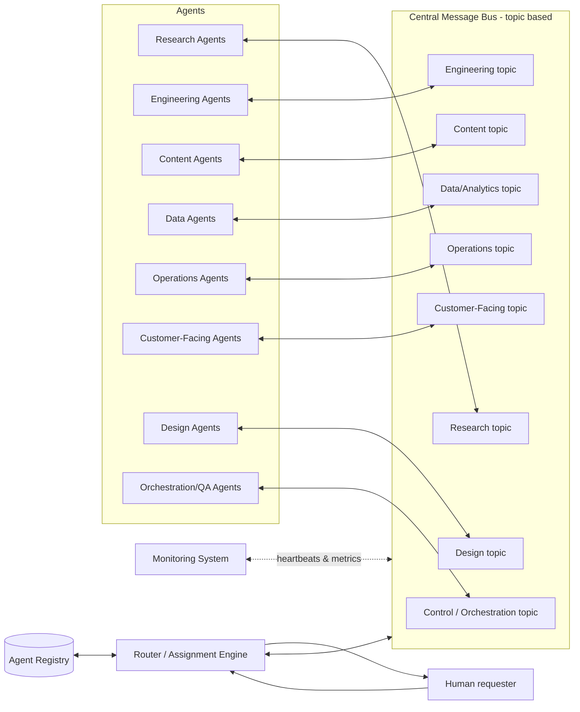
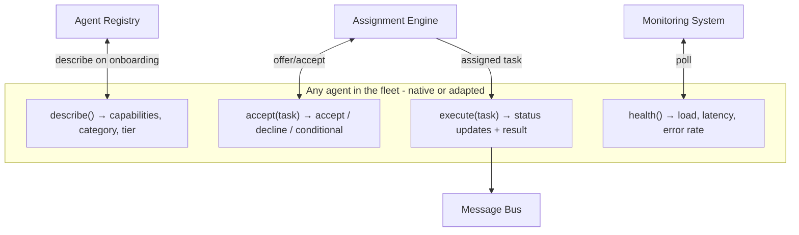

[diagram.md](https://github.com/user-attachments/files/31256216/diagram.md)
# System Diagram — Qimmah Command Center: 60-Agent Coordination System

This diagram accompanies `report.md`. It shows the end-to-end path a task takes from request to completion, and how the communication protocol connects agents to the message bus.

## 8.1 Work assignment flow

## 8.2 Communication topology

## 8.3 Standardized agent interface (per agent)

